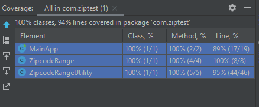

**The Zipcode challenge**

**Java version used**

java 11

junit5

maven

**Run Application**

Method 1: from IDE
Run main class it will ask enter the zip code range if its valid
then program will give the desired output

Method 2: from Command line or console

run following command to run application

cd target

`java com.ziptest.MainApp`

Junit 5 is used for Unit testing.
Total code coverage is 100%

